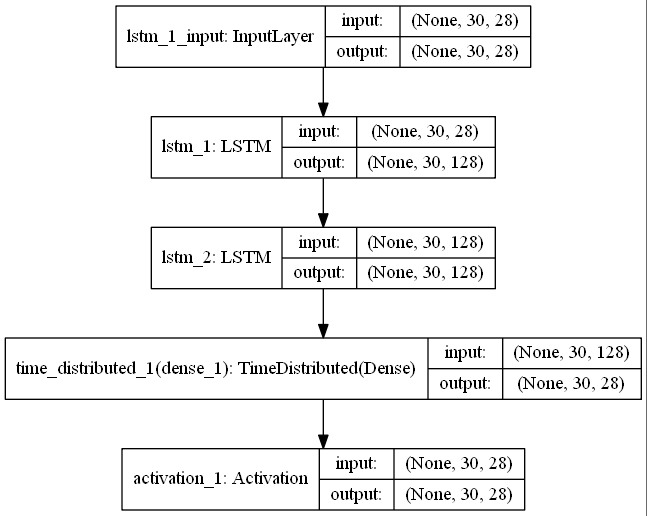
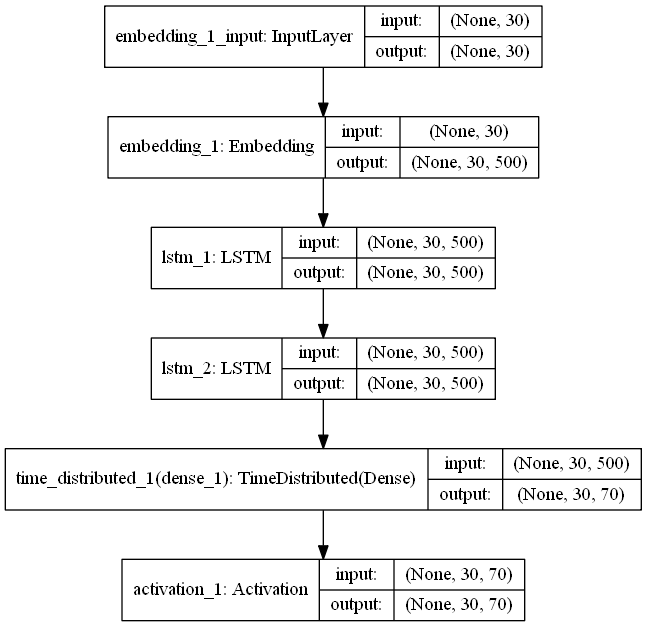

# LSTM-RAP-GENERATOR

LSTM recurrent neural network models to generate rap song lyrics. Train with an artist's discography. 
To execute, go to following code colab notebook:
https://colab.research.google.com/drive/1WlpeQvDRAiCu1wnZcjbdNKuUl9e4FEi8 

## Data generation (Rap_Export folder)

TODO

## Models

Character based generation:

Word based generation:

